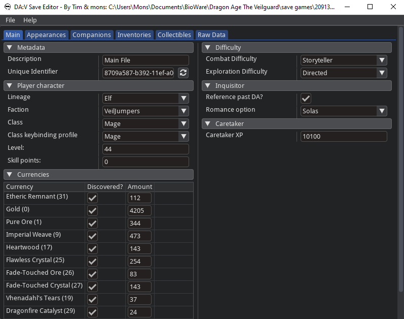
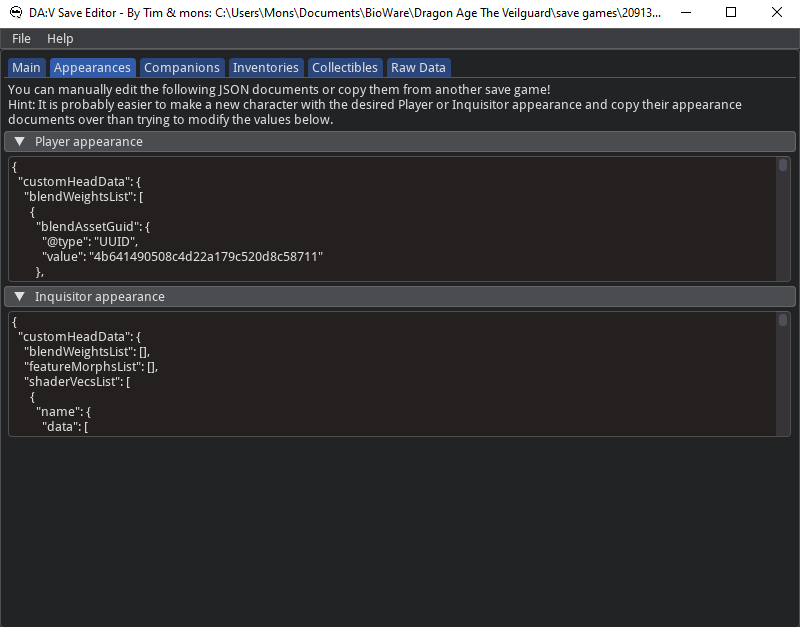
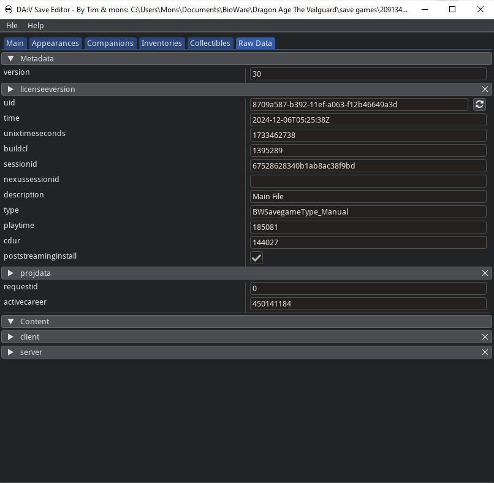
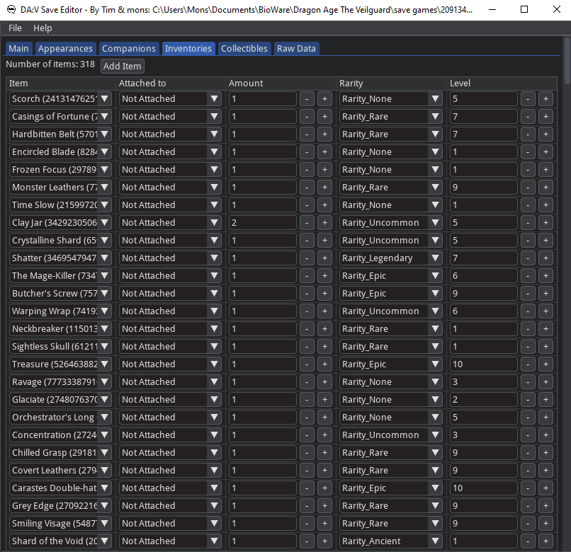
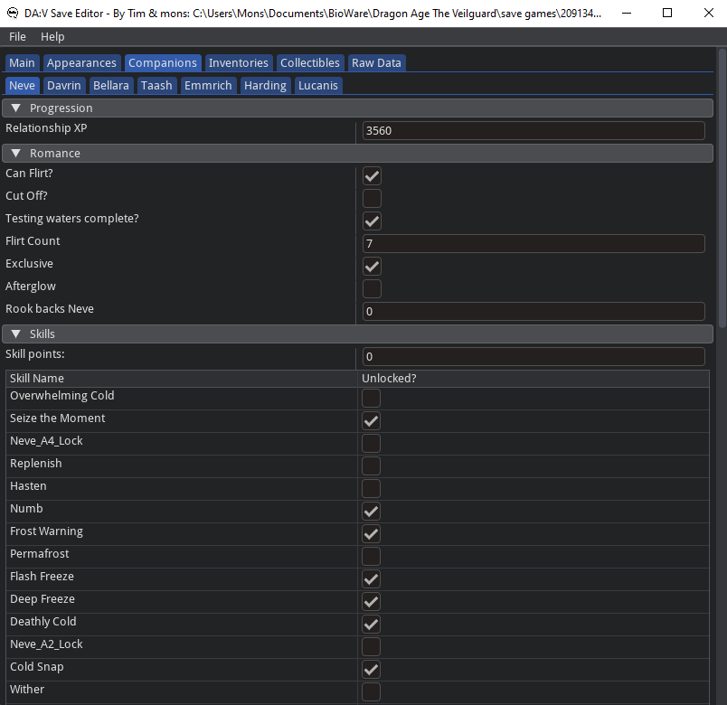
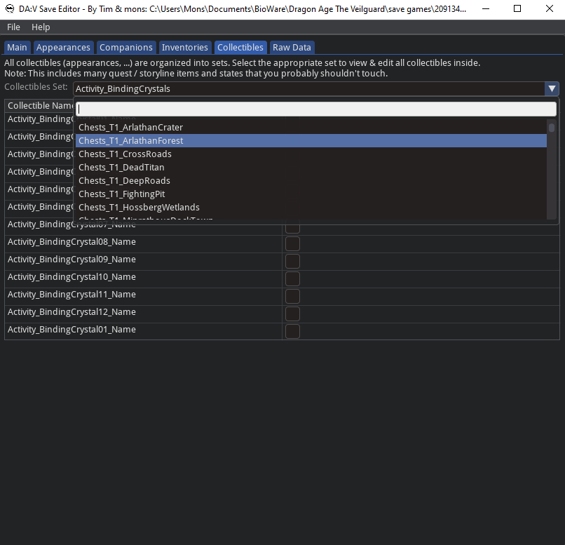

# Dragon Age: Save Game tools

This pure-Python library can read and write _Dragon Age: The Veilguard_ save files (`*.csav`).
Since version 1.0 it includes a graphical user interface to make editing the complex save data more accessible.
It also comes with several tools (`csav2json`, `json2csav`) that can convert the save games to and from easily editable `.json` documents.

<div align="center">



</div>

<div align="center">



</div>

## Features

- Edit your main character properties (Lineage, Faction, Class, Level, Skill points, ...)
- Change your Player & Inquisitor appearance
- Manage your and your companion's inventories.
- Edit companion state (i.e. romance flags, skills, ...)
- View and unlock all available collectibles (appearance items, ...)
- A very powerful raw data editor that allows you to change every part of the save game (for advanced use cases).

## Installation

Easy-to-use single-file binaries for the UI can be found on the [Releases page][5].
This is the preferred way for Windows users that only need the GUI version of the save file editor.

The full project is available for download from [PyPI][1]. You can install it using `pip`:
```bash
pip install --upgrade bw_save_game[ui]
```
This will give you the library, all the command-line tools and the UI.
Please note that this project requires at least Python 3.8.

## Usage

Using the graphical interface is pretty straightforward:
- Open the menu to load / import save files after which you have multiple tabs (Main, Appearances, ...) available.
- Make the changes you like and don't forget to use the menu to save (or press Ctrl+S).
- For more detailed guides, please visit our [Nexus Mods page][6].

If you installed the project via `pip` use `csav-ui [filename]` to launch the UI.

This project also ships two CLI applications that can convert a save game into a human-readable JSON document and vice-versa.
Editing this document allows you to change every part of a save, however, ensuring correctness and consistency is up to you.

The following command converts `0-439591 Saria-Save 9 #874.csav` to JSON:
```bash
csav2json "0-439591 Saria-Save 9 #874.csav" my_wip_save.json
```
Converting the edited save file `my_wip_save.json` back to the game's binary save game format is as easy as running:
```bash
json2csav my_wip_save.json "0-439591 Saria-Save 9 #874-NEW.csav"
```

The GUI also supports importing / exporting these JSON documents.

## Contributing

### Making Changes & Contributing

This project uses [pre-commit][4], please make sure to install it before making any
changes::

    pip install pre-commit
    cd bw_save_game
    pre-commit install

It is a good idea to update the hooks to the latest version::

    pre-commit autoupdate

## Licensing

[][2]

`bw_save_game` is Free Software under the terms of the
[GNU General Public License][3] as published by the Free Software Foundation,
either version 3 of the License, or (at your option) any later version.

[1]: https://pypi.org/project/bw_save_game/
[2]: http://www.gnu.org/licenses/gpl-3.0.en.html
[3]: https://www.gnu.org/licenses/gpl.html
[4]: https://pre-commit.com/
[5]: https://github.com/timniederhausen/bw_save_game/releases
[6]: https://www.nexusmods.com/dragonagetheveilguard/mods/1688
